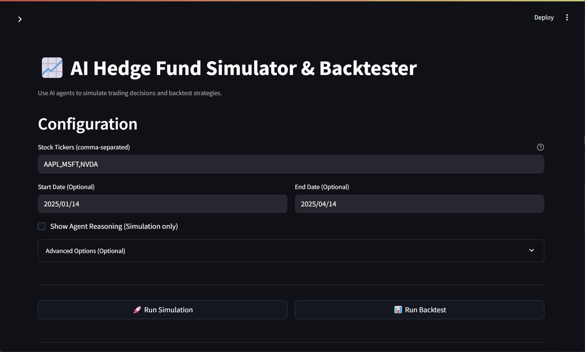

# AI Hedge Fund (Web Application)

This is a proof of concept for an AI-powered hedge fund. The goal of this project is to explore the use of AI to make trading decisions. This project is for **educational** purposes only and is not intended for real trading or investment.

**--- Web Application Adaptation ---**

This project provides an interactive web interface for the AI Hedge Fund simulation and backtesting tool originally developed by Virattt.

**Based on:** [virattt/ai-hedge-fund](https://github.com/virattt/ai-hedge-fund)

**Overview**

While the original project provides a powerful command-line interface (CLI) for simulating investment strategies using AI agents, this version adapts that core logic into a user-friendly web application built with [Streamlit](https://streamlit.io/).

The primary goal of this adaptation is to make the simulator more accessible, allowing users to configure parameters, run simulations/backtests, and view results directly within their web browser without needing extensive CLI interaction.

**Key Features of this Web Adaptation:**

*   **Interactive Web UI:** Configure tickers, dates, and options easily through a web form.
*   **Visual Results:** View final decisions, individual agent signals (grouped by type), performance metrics, and trade logs directly in the browser.
*   **Multilingual Support:** Interface available in English, Simplified Chinese (简体中文), and Traditional Chinese (繁體中文).
*   **Dynamic Translation:** Agent reasoning can be translated in real-time using the DeepL API (requires API key).
*   **Direct Core Logic Integration:** Leverages the refactored core simulation and backtesting functions from the underlying `ai-hedge-fund` logic.

This project retains the core agent-based simulation capabilities of the original while focusing on enhancing usability and accessibility through a web front-end.

**--- Original Project Agents ---**

This system employs several agents working together (inherited from the original project):

1. Ben Graham Agent - The godfather of value investing, only buys hidden gems with a margin of safety
2. Bill Ackman Agent - An activist investors, takes bold positions and pushes for change
3. Cathie Wood Agent - The queen of growth investing, believes in the power of innovation and disruption
4. Charlie Munger Agent - Warren Buffett's partner, only buys wonderful businesses at fair prices
5. Michael Burry Agent - The Big Short contrarian who hunts for deep value
6. Peter Lynch Agent - Practical investor who seeks "ten-baggers" in everyday businesses
7. Phil Fisher Agent - Meticulous growth investor who uses deep "scuttlebutt" research 
8. Stanley Druckenmiller Agent - Macro legend who hunts for asymmetric opportunities with growth potential
9. Warren Buffett Agent - The oracle of Omaha, seeks wonderful companies at a fair price
10. Valuation Agent - Calculates the intrinsic value of a stock and generates trading signals
11. Sentiment Agent - Analyzes market sentiment and generates trading signals
12. Fundamentals Agent - Analyzes fundamental data and generates trading signals
13. Technicals Agent - Analyzes technical indicators and generates trading signals
14. Risk Manager - Calculates risk metrics and sets position limits
15. Portfolio Manager - Makes final trading decisions and generates orders


**Note**: the system simulates trading decisions, it does not actually trade.

[](https://twitter.com/virattt)

## Disclaimer

This project is for **educational and research purposes only**.

- Not intended for real trading or investment
- No warranties or guarantees provided
- Past performance does not indicate future results
- Creator assumes no liability for financial losses
- Consult a financial advisor for investment decisions

By using this software, you agree to use it solely for learning purposes.

## Table of Contents
- [Setup](#setup)
- [Usage](#usage)
  - [Running the Web Application](#running-the-web-application)
  - [Running the Original CLI (Optional)](#running-the-original-cli-optional)
- [Project Structure](#project-structure)
- [Contributing](#contributing)
- [Feature Requests](#feature-requests)
- [License](#license)

## Setup

Clone the repository:
```bash
git clone https://github.com/bryankuok2024/ai-hedge-fund-web.git # Updated URL
cd ai-hedge-fund-web
```

1. Install Poetry (if not already installed):
```bash
curl -sSL https://install.python-poetry.org | python3 -
```

2. Install dependencies:
```bash
poetry install
```

3. Set up your environment variables:
```bash
# Create .env file for your API keys
cp .env.example .env
```

4. Set your API keys in the `.env` file:
   - `OPENAI_API_KEY` (or other LLM provider key like `GROQ_API_KEY`, `ANTHROPIC_API_KEY`, `DEEPSEEK_API_KEY`) is required for the core AI agents.
   - `DEEPL_API_KEY` is required for dynamic translation in the web interface.
   - `FINANCIAL_DATASETS_API_KEY` is required for analyzing tickers other than AAPL, GOOGL, MSFT, NVDA, TSLA.

See `.env.example` for all available options.

## Usage

### Running the Web Application

This is the primary way to use this version of the project.

First, ensure you have installed the dependencies:
```bash
poetry install
```
Then, start the Streamlit server:
```bash
poetry run streamlit run src/webapp.py
```
This will open the application in your default web browser. You can then configure the tickers, dates, and options directly in the web interface and run simulations or backtests.

*(Below is a screenshot of the main interface)*


### Running the Original CLI (Optional)

While the focus of this repository is the web interface, the original command-line tools (`main.py`, `backtester.py`) are still present and functional if you prefer to use them directly or for debugging.

**Hedge Fund Simulation:**
```bash
poetry run python src/main.py --ticker AAPL,MSFT,NVDA
```
*Use `--show-reasoning` to print agent reasoning.* 
*Use `--start-date` and `--end-date` for specific periods.*

**Backtester:**
```bash
poetry run python src/backtester.py --ticker AAPL,MSFT,NVDA
```
*Use `--start-date` and `--end-date` for specific periods.*

## Project Structure 
```
ai-hedge-fund/
├── src/
│   ├── agents/                   # Agent definitions and workflow
│   │   ├── bill_ackman.py        # Bill Ackman agent
│   │   ├── fundamentals.py       # Fundamental analysis agent
│   │   ├── portfolio_manager.py  # Portfolio management agent
│   │   ├── risk_manager.py       # Risk management agent
│   │   ├── sentiment.py          # Sentiment analysis agent
│   │   ├── technicals.py         # Technical analysis agent
│   │   ├── valuation.py          # Valuation analysis agent
│   │   ├── warren_buffett.py     # Warren Buffett agent
│   │   ├── webapp.py             # Streamlit web application (NEW!)
│   ├── tools/                    # Agent tools
│   │   ├── api.py                # API tools
│   ├── backtester.py             # Backtesting tools
│   ├── main.py                   # Main entry point
├── pyproject.toml
├── ...
```

## Contributing

1. Fork the repository
2. Create a feature branch
3. Commit your changes
4. Push to the branch
5. Create a Pull Request

**Important**: Please keep your pull requests small and focused.  This will make it easier to review and merge.

## Feature Requests

If you have a feature request for this **web application adaptation**, please open an [issue](https://github.com/bryankuok2024/ai-hedge-fund-web/issues) in *this* repository and make sure it is tagged with `enhancement`.

For requests related to the core agent logic, consider contributing to the original [virattt/ai-hedge-fund](https://github.com/virattt/ai-hedge-fund) repository.

## License

This project is licensed under the MIT License - see the LICENSE file for details.
